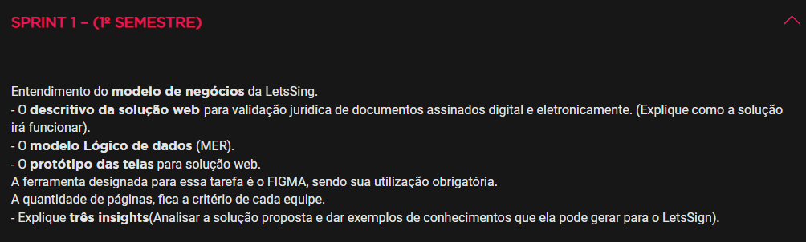
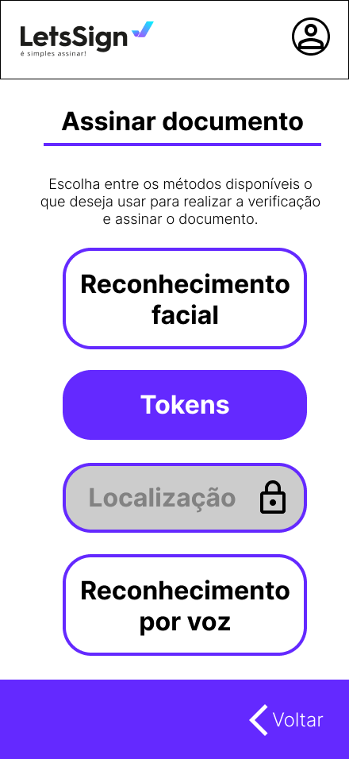

🟢 🟡 🔴

# Challenge_LetsSing_FIAP

**🛠️ Desafio:** Soluções Inovadoras para Validação Jurídica de Documentos Assinados Digital e Eletronicamente.

**📚 Contexto:**
Este desafio é parte dos *Challenges* anuais propostos pela FIAP em parceria com empresas externas. Em 2024, o parceiro é a *LetsSing*, que busca soluções criativas para validar juridicamente documentos assinados digitalmente, assegurando segurança e confiabilidade. 

[**📄 Apresentação oficial do Challenge**](Challenge_LetsSing_apresentacao.pdf)

OBS: O inicio do primeiro sprint desse challenge se deu no dia 13/11/2024 com entrega para o dia 04/12/2024.

---

## 🚀 Minha proposta de solução (Primeiro Sprint)

O projeto propõe a criação de um sistema inovador e robusto que utiliza tecnologias de ponta, como:

- **⛓️ Blockchain**
- **📸 Reconhecimento facial**
- **🔑 Tokens OTP (One-Time Password)**
- **📍 Geolocalização**
- **🗣️ Autenticação por Voz**

Essas ferramentas são integradas para garantir segurança, acessibilidade e interoperabilidade, atendendo às necessidades de usuários em diferentes regiões e jurisdições. Além disso, o sistema prioriza a prevenção contra fraudes, permitindo aos usuários maior controle e confiança sobre seus documentos digitais.

---

## 🎯 Objetivo

O objetivo principal é fornecer um sistema confiável que:

- ✅ Assegure a autenticidade de assinaturas digitais.
- 📂 Facilite a gestão e validação de documentos assinados.
- ⚡ Proporcione comodidade e rapidez na verificação de documentos.
- 🌐 Permita interoperabilidade entre sistemas e aceitação jurídica em diferentes países.
- 🔒 Prevenha fraudes e discrepâncias em documentos eletrônicos.

---

## 🧩 Componentes do sistema

### 1. ⛓️ Blockchain para Validação de Documentos

O sistema utiliza blockchain para registrar documentos e assinaturas de forma descentralizada, garantindo transparência e segurança.

**✨ Principais Funcionalidades:**

- **🌍 Validade Jurídica Internacional:** Aceitação em diferentes países.
- **🔗 Interoperabilidade:** Integração com sistemas jurídicos e econômicos.
- **🛡️ Registro Imutável:** Dados protegidos contra alterações e falsificações.
- **🔍 Auditabilidade:** Rastreabilidade de uso indevido ou inconsistências.

**📌 Como funciona:**
Cada documento é vinculado ao CPF do usuário, permitindo fácil localização e autenticação no sistema.

---

### 2. 📸 Reconhecimento Facial

A biometria facial é usada para criar um perfil único do usuário com base em fotos analisadas pelo sistema.

**✨ Principais Funcionalidades:**

- **📥 Registro e Autenticação:** Imagens dos documentos e fotos em tempo real criam o perfil biométrico do usuário.
- **🔄 Atualizações Dinâmicas:** O sistema solicita novas fotos para ajustar a biometria conforme mudanças faciais.
- **🔒 Segurança:** O perfil biométrico é utilizado para autenticar assinaturas e proteger o acesso ao sistema.

---

### 3. 🔑 Sistema de Tokens OTP

A implementação de autenticação multifatorial (MFA) com tokens OTP adiciona uma camada extra de segurança.

**✨ Principais Funcionalidades:**

- **📤 Entrega Flexível:** Tokens enviados via SMS, WhatsApp ou e-mail, conforme preferência do usuário.
- **⏱️ Validade Temporária:** Cada código, composto por 6 dígitos, é gerado aleatoriamente e válido por até 45 segundos.
- **🔍 Monitoramento:** Tentativas de acesso com códigos inválidos são registradas, notificando o usuário sobre atividades suspeitas.

---

### 4. 📍 Geolocalização

A utilização da localização geográfica adiciona segurança ao validar assinaturas em regiões autorizadas.

**✨ Principais Funcionalidades:**

- **🗺️ Regiões Autorizadas:** Assinaturas liberadas apenas em regiões cadastradas pelo usuário.
- **📌 Flexibilidade:** Permite configurar várias regiões autorizadas.
- **📜 Histórico Transparente:** Registros de geolocalizações são armazenados no blockchain para maior segurança.

---

### 5. 🗣️ Autenticação por Voz

A autenticação por voz oferece mais acessibilidade e segurança aos usuários.

**✨ Principais Funcionalidades:**

- **🎙️ Frase Personalizada:** Usuários gravam uma frase que será utilizada para validação de assinaturas.
- **♿ Acessibilidade:** Ideal para usuários com deficiência que dificultem o uso de outros métodos.
- **🛡️ Segurança por Padrões Vocais:** Verificação da entonação e padrões únicos da voz para prevenir falsificações.

---

### 🔒 Configurações de Verificação

Os usuários têm a flexibilidade de ativar ou desativar os métodos de verificação disponíveis, desde que ao menos dois estejam ativos. 

**🔐 Detalhes Adicionais:**

- **🔄 Configurações Dinâmicas:** Métodos de verificação adaptáveis ao dispositivo.
- **🛠️ Requer Autenticação Prévia:** Alterações nas configurações necessitam de autenticação, adicionando proteção.
- **📊 Recomendações Personalizadas:** O sistema analisa padrões de uso e sugere melhorias de segurança.

---

O sistema proposto combina inovação, segurança e acessibilidade para atender às demandas da transformação digital e facilitar a validação de documentos assinados eletronicamente. Com a integração de blockchain e métodos avançados de autenticação, os usuários terão uma solução confiável e prática para suas necessidades jurídicas e administrativas. Além disso, o projeto abre caminho para futuras inovações em tecnologias de assinatura digital, aumentando ainda mais a confiança em transações eletrônicas globais.
